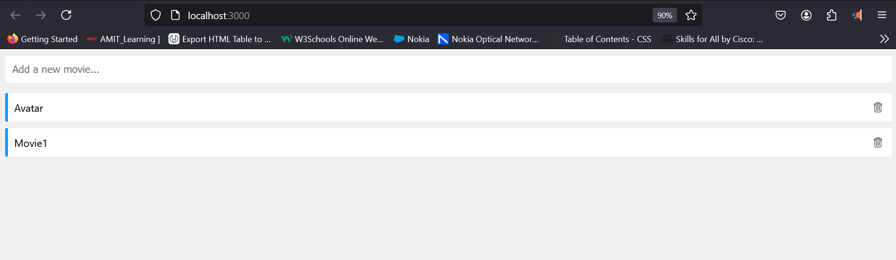

# Full Stack Web Application with Docker

This project demonstrates how to containerize a full-stack web application (comprising frontend and backend) using Docker and Docker Compose. The project aims to provide an easy-to-deploy setup for a full-stack web application, facilitating development and production workflows.

## Table of Contents

- [Project Structure](#project-structure)
- [Prerequisites](#prerequisites)
- [Setup and Installation](#setup-and-installation)
- [Usage](#usage)
- [Docker Compose File](#docker-compose-file)
- [Building Docker Images](#building-docker-images)
- [Running the Application](#running-the-application)
- [Stopping the Application](#stopping-the-application)
- [Results](#Results)

## Project Structure

The project is organized into the following structure:

- `frontend/`: Contains the frontend source code and Dockerfile.
- `backend/`: Contains the backend source code and Dockerfile.
- `docker-compose.yml`: Docker Compose configuration file to run the application.

## Prerequisites

Ensure you have the following installed on your system:

- [Docker](https://www.docker.com/)
- [Docker Compose](https://docs.docker.com/compose/)

## Setup and Installation

1. **Clone the repository:**

    ```sh
    git clone https://github.com/hanyhm/DevOps.git
    cd DevOps
    ```

2. **Navigate to the project directory:**

    ```sh
    cd Project1
    ```

## Usage

### Docker Compose File

Here is the `docker-compose.yml` file used to define and run the multi-container Docker application:

```yaml
version: "3.8"

services:
  web:
    build: ./frontend
    ports:
      - 3000:3000
  api:
    build: ./backend
    ports:
      - 3001:3001
    environment:
      DB_URL: mongodb://db/vidly
  db:
    image: mongo:4.0-xenial
    ports:
      - 27017:27017
    volumes:
      - vidly:/data/db
volumes:
  vidly:
```


## Building Docker Images

To build the Docker images for both the frontend and backend services, run the following command:

```sh
docker-compose build
```

## Running the Application

To start the application, run:

```sh
docker-compose up
```

This will start both the frontend and backend services, mapping the respective ports to your host machine.
Stopping the Application

## Stopping the Application

To stop the application, press CTRL+C in the terminal where docker-compose up is running, or run:

```sh
docker-compose down
```

This will stop and remove the containers defined in the `docker-compose.yml` file.

## Results


```sh
PS G:\DevOps\Project2> docker compose up
time="2024-07-31T11:53:45+03:00" level=warning msg="G:\\DevOps\\Project2\\docker-compose.yml: `version` is obsolete"
[+] Building 2.6s (19/19) FINISHED            docker:desktop-linux
 => [api internal] load build definition from Dockerfile      0.1s
 => => transferring dockerfile: 228B                          0.0s
 => [web internal] load build definition from Dockerfile      0.1s
 => => transferring dockerfile: 227B                          0.0s
 => [api internal] load metadata for docker.io/library/node:  1.7s
 => [api auth] library/node:pull token for registry-1.docker  0.0s
 => [web internal] load .dockerignore                         0.1s
 => => transferring context: 627B                             0.0s
 => [api internal] load .dockerignore                         0.0s
 => => transferring context: 627B                             0.0s
 => [web 1/6] FROM docker.io/library/node:14.16.0-alpine3.13  0.0s
 => [api internal] load build context                         0.0s
 => => transferring context: 1.37kB                           0.0s
 => [web internal] load build context                         0.0s
 => => transferring context: 1.09kB                           0.0s
 => CACHED [web 2/6] RUN addgroup app && adduser -S -G app a  0.0s
 => CACHED [web 3/6] WORKDIR /app                             0.0s
 => CACHED [api 4/6] COPY package*.json ./                    0.0s
 => CACHED [api 5/6] RUN npm install                          0.0s
 => CACHED [web 4/6] COPY package*.json ./                    0.0s
 => CACHED [web 5/6] RUN npm install                          0.0s
 => CACHED [web 6/6] COPY . .                                 0.0s
 => [api 6/6] COPY . .                                        0.2s
 => [web] exporting to image                                  0.1s
 => => exporting layers                                       0.0s
 => => writing image sha256:67c4df3bb0f1c1b95e4f7a164064a243  0.0s
 => => naming to docker.io/library/project2-web               0.0s 
 => [api] exporting to image                                  0.3s
 => => exporting layers                                       0.2s 
 => => writing image sha256:36bea32e0533ce1557d6e74806ba4891  0.0s
 => => naming to docker.io/library/project2-api               0.0s 
[+] Running 5/5
 ✔ Network project2_default  Cr...                            0.1s 
 ✔ Volume "project2_vidly"   Cre...                           0.0s 
 ✔ Container project2-web-1  Cr...                            0.3s 
 ✔ Container project2-api-1  Cr...                            0.3s 
 ✔ Container project2-db-1   Cre...                           0.3s 
...
...
...
                                                          
web-1  | Compiled successfully!
web-1  | 
web-1  | You can now view vidly-frontend in the browser.
web-1  | 
web-1  |   Local:            http://localhost:3000
web-1  |   On Your Network:  http://172.19.0.4:3000
web-1  | 
web-1  | Note that the development build is not optimized.
web-1  | To create a production build, use npm run build.
web-1  | 
web-1  | webpack compiled successfully
web-1  | Compiling...
web-1  | Compiled successfully!
web-1  | webpack compiled successfully
```

Open http://localhost:3000 to check your application.

