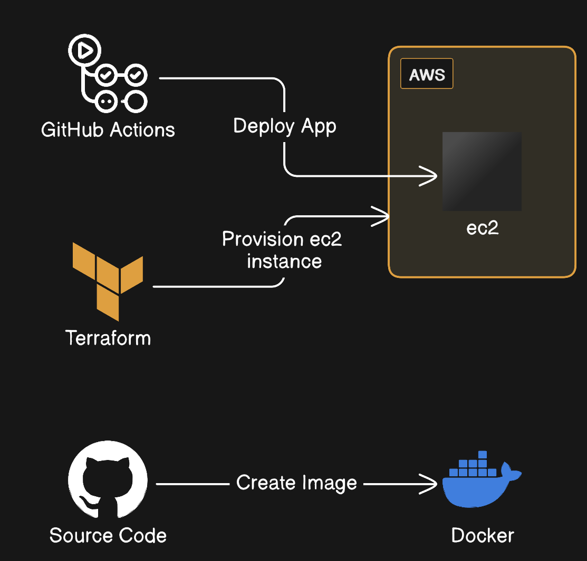

# Project Guide

## Introduction:
This is a demo project to practice DevOps Tools.

## Purpose
The primary purpose of this project is to:

- Create a Docker image of NodeJS application.
- Upload the Docker image to Docker Hub.
- Provision AWS EC2 instances using Terraform.
- Automate the deployment of our application to AWS EC2 instances using GitHub Actions.

## Project Diagram


## Tools and Technologies
### Docker
- **Role**: To create a containerized image of the application
- **Final Destination**: Docker Hub
### Terraform
- **Role**: Infrastructure provisioning
- **Target**: AWS EC2 instances
### AWS
- **Service Provider**: Amazon Web Services (AWS)
- **Role**: Hosting the EC2 instances where the application will be deployed
### GitHub Actions
- **Role**: To automate the deployment process to AWS EC2 instances
## Workflow Summary 
1. **Docker**: Create a Docker image of the application and upload it to Docker Hub.
2. **Terraform**: Use Terraform scripts to provision AWS EC2 instances.
3. **GitHub Actions**: Automate the deployment of the Docker image from Docker Hub to the provisioned AWS EC2 instances.

## How to Run this Project?

# Steps:

## A- Clone and run the app:

1: Clone the App repo:
```sh
git clone https://github.com/hanyhm/DevOPS/Project1.git
```

2: Install dependencies:
CD into the project Folder and install dependencies: 
```sh
CD Project1
npm install
```

3: App testing:
```sh
npm test
```

4: Run the app:
```sh
npm start
```
Open http://localhost:3000 to view the app in your browser.


## B- Docker to create a docker image:

You must have Docker installed on your machine and have account on docker hub. For this project I am using my Docker Hub account as example for demonestration and you shoud use your credentials instead of mine.

1: Create Docker Image:
```sh
docker build -t todo-app .
```

2: Run image and access application:
```sh
docker run todo-app -p 3000:3000
```
Open http://localhost:3000 to view the app in your browser.

3: Push image to Docker Hub:
```sh

docker login
Username: hanyhm1234
Password: **********

docker tag todo-app hanyhm1234/devops:todo-app 

docker push hanyhm1234/devops:todo-app
```

You can check your image on Docker hub repository.

[Docker Hub Repository - hanyhm1234/devops](https://hub.docker.com/repository/docker/hanyhm1234/devops/)

### Docker Results:

```markdown
## docker build -t todo-app .

### Command Output:

**[+] Building 107.1s (11/11) FINISHED                               docker:default
 => [internal] load .dockerignore                                            0.1s
 => => transferring context: 629B                                            0.0s
 => [internal] load build definition from Dockerfile                         0.1s
 => => transferring dockerfile: 228B                                         0.0s
 => [internal] load metadata for docker.io/library/node:14.16.0-alpine3.13   2.9s
 => [1/6] FROM docker.io/library/node:14.16.0-alpine3.13@sha256:2c51dc462a  15.6s
 => => resolve docker.io/library/node:14.16.0-alpine3.13@sha256:2c51dc462a0  0.1s
 => => sha256:074ae49463c4f38ae0a7b325d47187e75bc59b07639d2 2.36MB / 2.36MB  1.1s
 => => sha256:2c51dc462a02f15621e7486774d36d048a27225d58137 1.43kB / 1.43kB  0.0s
 => => sha256:aaa14c316ef4221bace52357a6a9633238ed575dbb8ae 1.16kB / 1.16kB  0.0s
 => => sha256:50bfd284aa0daf62e9fe0f08db4905a4f9eb9456ad577 6.73kB / 6.73kB  0.0s
 => => sha256:ca3cd42a7c9525f6ce3d64c1a70982613a8235f0cc057 2.81MB / 2.81MB  2.1s
 => => sha256:cf8dc363e30fa6d6a24fafe0c593ea0447c0fbe2ec 35.91MB / 35.91MB  11.9s
 => => sha256:48fd78e4b5321d188146bc79a6b38f93ad9bc0958939a8ecb 282B / 282B  1.7s
 => => extracting sha256:ca3cd42a7c9525f6ce3d64c1a70982613a8235f0cc057ec924  0.2s
 => => extracting sha256:cf8dc363e30fa6d6a24fafe0c593ea0447c0fbe2ec3f1a7e6c  2.9s
 => => extracting sha256:074ae49463c4f38ae0a7b325d47187e75bc59b07639d2e312d  0.1s
 => => extracting sha256:48fd78e4b5321d188146bc79a6b38f93ad9bc0958939a8ecbd  0.0s
 => [internal] load build context                                            0.2s
 => => transferring context: 862.64kB                                        0.1s
 => [2/6] RUN addgroup app && adduser -S -G app app                          0.6s
 => [3/6] WORKDIR /app                                                       0.1s
 => [4/6] COPY package*.json ./                                              0.1s
 => [5/6] RUN npm install                                                   80.9s
 => [6/6] COPY . .                                                           0.1s
 => exporting to image                                                       6.4s
 => => exporting layers                                                      6.4s
 => => writing image sha256:d463bbf25a0a8b54c4ec4635d15bbb62eb762a7ce5f9386  0.0s
 => => naming to docker.io/library/todo-app**

```
```markdown
## docker push hanyhm1234/devops:todo-app

### Command Output:

**The push refers to repository [docker.io/hanyhm1234/devops]
72c506e41911: Pushed
67bf3bbf19e9: Pushed
a18621279f0c: Pushed
be909ff2462d: Pushed
82a0a2ab62b9: Pushed
798e08027938: Mounted from library/node
33cef85d9393: Mounted from library/node
bcc9629c254f: Mounted from library/node
8ea3b23f387b: Mounted from library/node
todo-app: digest: sha256:5e5197c9513ef97b6c5ed8c3e0ab043a00dbbbdbc9098c67743fc54cdaba987c size: 2205**

```


## C- Terraform to create an EC2 instance:

You must have Terraform installed on your system, AWS amazon account to create EC2 instance (I use free account for this Demo).


## Conclusion
This project integrates Docker, Terraform, AWS, and GitHub Actions to streamline the process of containerizing an application, provisioning infrastructure, and automating deployment.

